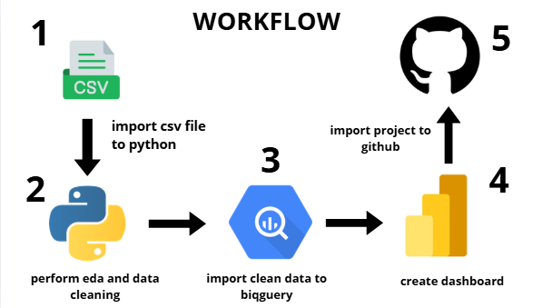
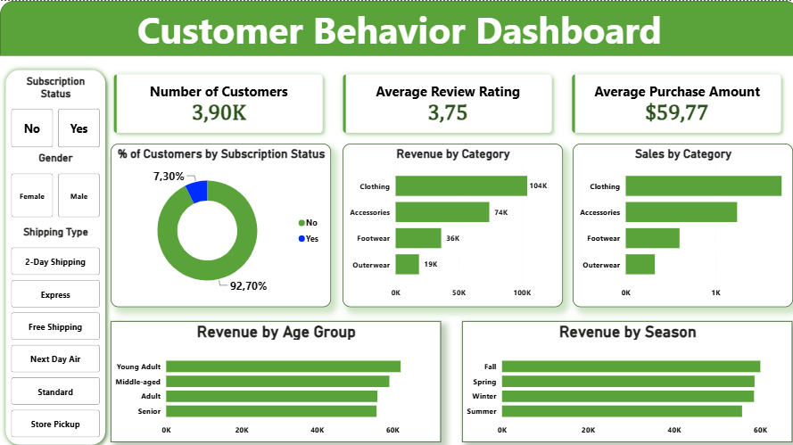

# Customer Behavior Analysis Project

# Project Overview
This project aims to analyze customers’ purchase history using various features, such as age, purchase amount, gender, and other relevant attributes, in order to gain valuable insights into customer behavior. The insights obtained from this analysis can support data-driven decision-making 
and help determine appropriate strategies for future business activities.

# Workflow

1. Import the CSV dataset into Google Colab using Python.
2. Perform data cleaning, feature engineering, and Exploratory Data Analysis (EDA) using Python to prepare and understand the dataset.
3. After the data has been cleaned and transformed, establish a connection and upload the processed dataset to Google BigQuery.
4. Perfome some analysis with SQL.
5. Connect Google BigQuery to Power BI to load the dataset and create an interactive dashboard.
6. Identify and analyze key business insights through the dashboard, such as total customers, total revenue, customer purchasing behavior, and other relevant performance indicators.

# Tools
1. Google Colab (Python)
2. Google Bigquery
3. Power BI

# Dashboard

# Documentations
1. [Dataset](https://github.com/Yogaaprila/Customer-trend-data-analysis/blob/main/customer_shopping_behavior.csv)
2. [Python Script](https://github.com/Yogaaprila/Customer-trend-data-analysis/blob/main/data_modeling_and_eda.ipynb)
3. [SQL Query](https://github.com/Yogaaprila/Customer-trend-data-analysis/blob/main/customer_analysis.sql)
4. [Dashboard pbix file](https://github.com/Yogaaprila/Customer-trend-data-analysis/blob/main/customer_analysis_dashboard.pbix)

